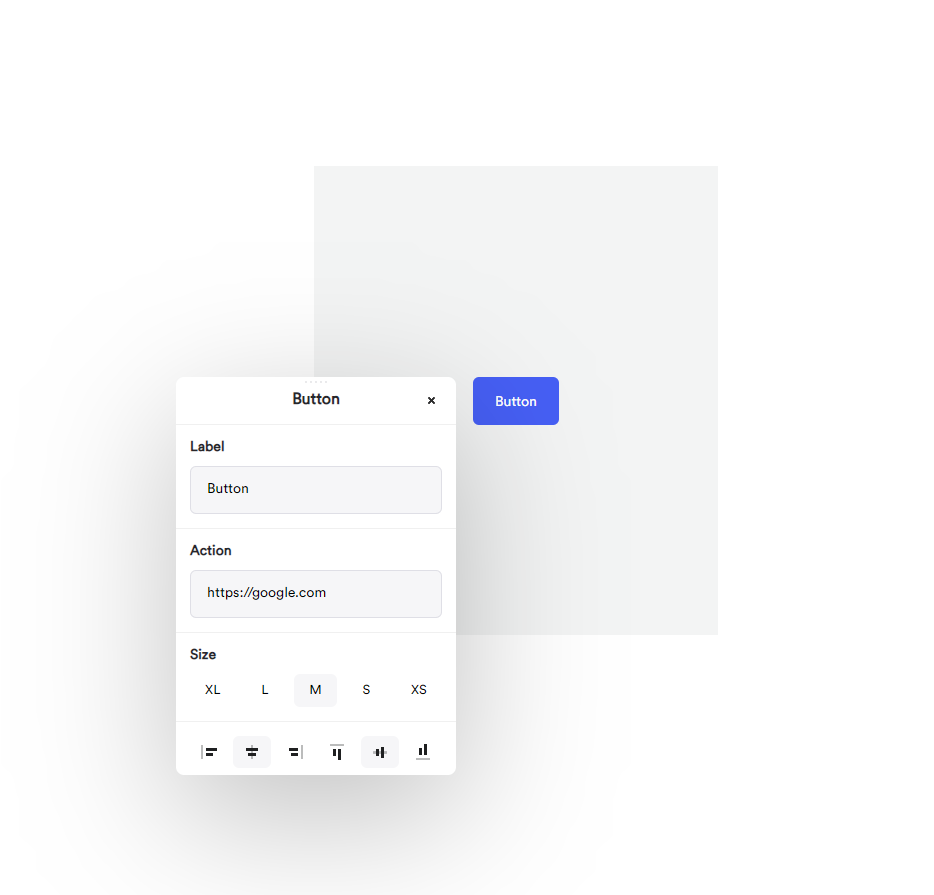

# Button-App

Onepage test task - create an interactive button with parameters. By click should be opened popup with parameters, where you can change them. Changes in parameters should be applied imidietly

# How to run locally
1. clone this repository
    - git clone https://github.com/lysenko86/button-app.git
2. go to project folder and install packages
    - npm install
3. run project locally
    - npm run start
4. it should be started here
    - http://localhost:3000/
